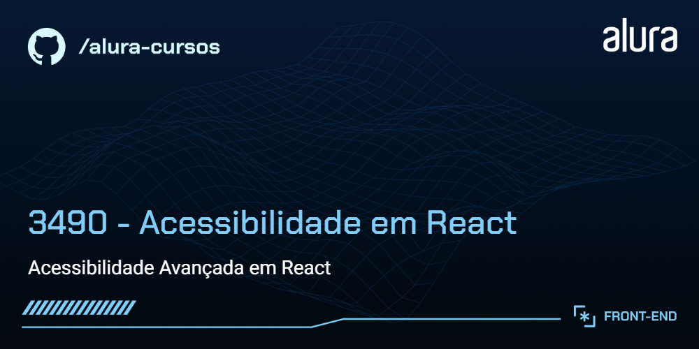

# Zoop Megastore

A Zoop é um e-commerce de varejo que vende de tudo! Atualmente em fase de desenvolvimento, seu site carece de recursos que tornem ele acessível para todas as pessoas que acessam e navegam por ele.


## 🔨 Funcionalidades do projeto

Neste estágio inicial de desenvolvimento, a Zoop possui as seguintes funcionalidades:

- Navegar pela aplicação
- Interagir com elementos visuais da aplicação como modais, acordeões, etc.
- Visualizar a página de produtos

O [Figma dessa aplicação você encontra aqui](https://www.figma.com/file/1KuCFIRKOIZVrb0f6nLbVw/React-Acessibilidade?node-id=59%3A852&mode=dev).


## ✔️ Técnicas e tecnologias utilizadas

O projeto Zoop utiliza as seguintes tecnologias e bibliotecas:

- `React` - Framework JavaScript
- `Vite` - Build tool para desenvolvimento rápido
- `TypeScript` - Linguagem de programação principal
- `React Router Dom` - Biblioteca para gerenciamento de rotas
- `classnames` - Biblioteca para gerenciamento de classes css
- `Figma` - Para prototipagem do projeto

E muito mais...

## 🛠️ Abrir e rodar o projeto

Para executar o projeto Meteora em seu ambiente local, siga estas etapas:

1. Certifique-se de ter o Node.js instalado em sua máquina.

2. Baixe o repositório do projeto.

3. Extraia os arquivos para uma pasta de sua preferência.

4. Navegue até a pasta em questão via terminal (cmd):

```bash
cd repo-zoop
```

5. Instale as dependências usando o npm:

```bash
npm install
```

6. Inicie o projeto localmente:

```bash
npm run dev
```

## 📚 Mais informações do curso

Gostou do projeto e quer conhecer mais? 

O design e protótipo deste projeto podem ser encontrados [aqui](https://www.figma.com/file/1KuCFIRKOIZVrb0f6nLbVw/React-Acessibilidade?node-id=59%3A852&mode=dev).

Aproveite o desenvolvimento e aprimoramento da Zoop!

