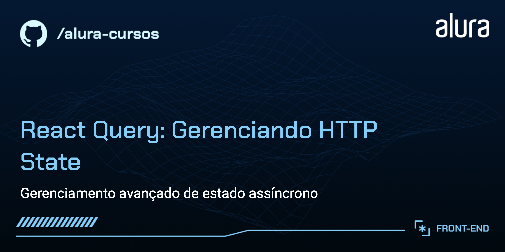

# Título do Curso: React Query: Gerenciando HTTP State

Curso prático de React Query, uma ferramenta poderosa para gerenciar o estado de operações HTTP em aplicações React. Com um foco específico no método GET e no uso do hook useQuery, este curso guiará você através de conceitos fundamentais até a implementação prática. Ideal para desenvolvedores que desejam melhorar a performance e a simplicidade de suas aplicações ao lidar com dados assíncronos.

## 🔨 Funcionalidades do Projeto

O curso abrange a integração do Back-end com o Front-end de um blog dinâmico:

- Listagem de posts com paginação.
- Exibição detalhada de cada post.
- Integração com APIs usando fetch através do Ract-query.

## ✔️ Técnicas e Tecnologias Utilizadas

As principais técnicas e tecnologias abordadas são:

- `Introdução ao React-query`: compreensão como o React Query simplifica a gestão de estado para operações HTTP em aplicações React.
- `Técnicas avançadas`: melhores práticas e técnicas avançadas para otimizar as requisições GET e a interação com APIs.
- `Implementação com useQuery`: utilização do hook `useQuery` para realizar a integração de APIs, gerenciando carregamento, erros e cache.
- `React-query Devtools`: configuração e utilização da ferramenta para facilitar a depuração e aumentar a visibilidade dos dados geridos pelo React-qury.
- `Fetch API`: realizar requisições HTTP para buscar dados.

## 🎯 Desafios do Curso

Implementação de funcionalidades avançadas, como:

- Consumo de uma API de posts usando React-query.
- Retentativas de requisições que falham.
- Prefetch de dados.

## 🛠️ Abrir e Rodar o Projeto

Após baixar o projeto, você pode abrir com seu editor de código preferido. Siga estes passos:

- Abra o terminal no diretório do projeto.
- Na raiz do projeto execute `docker compose up`.
- Execute `yarn` para instalar as dependências.
- Execute `yarn build` para contruir a aplicação.
- Inicie o servidor de desenvolvimento com `yarn dev`.
- Acesse `http://localhost:3000` no navegador para ver o projeto.
